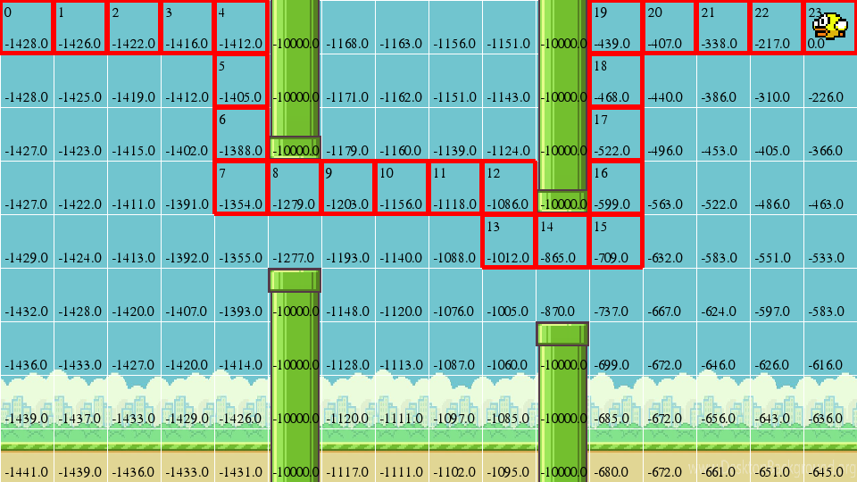
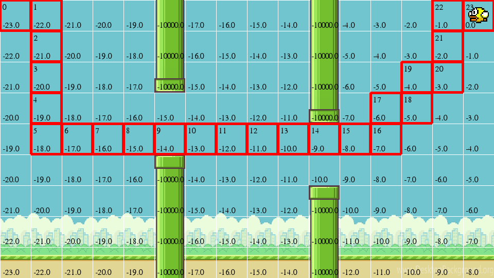
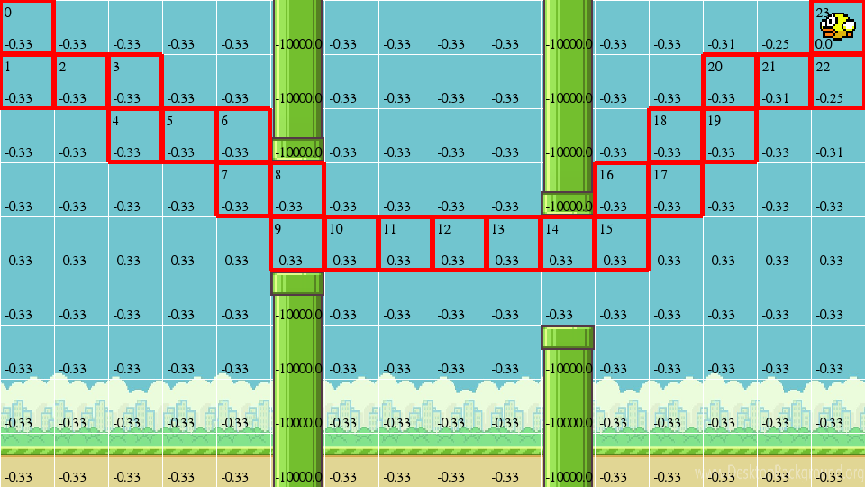
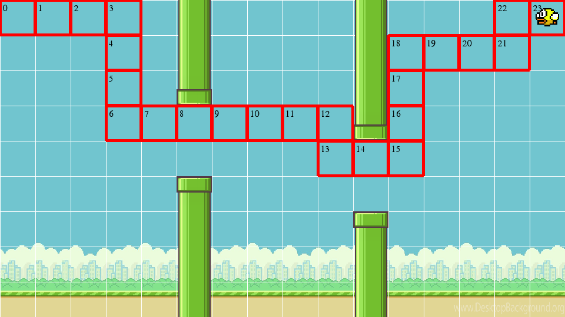
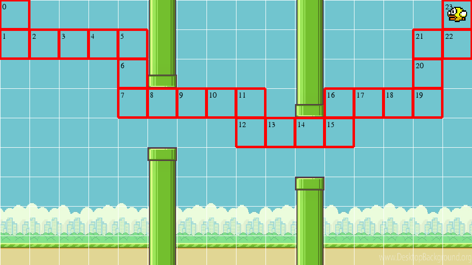

[TOC]

# Reinforcement Learning Homework

Homework for reinforcement learning course in NanKai University for graduate student.

## Course Book

R. S. Sutton and A. G. Barto, "Reinforcement Learning : An Introduction" 2017.

## The 3rd Homework

### Game interface

## The 4th Homework

### Markov: Random

### Markov: Policy Iteration

### Markov: Value Iteration

### The 5th Homework

### Monte Carlo: Exploring Starts

### Monte Carlo: On Policy

